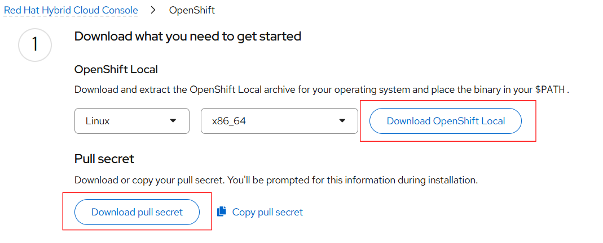
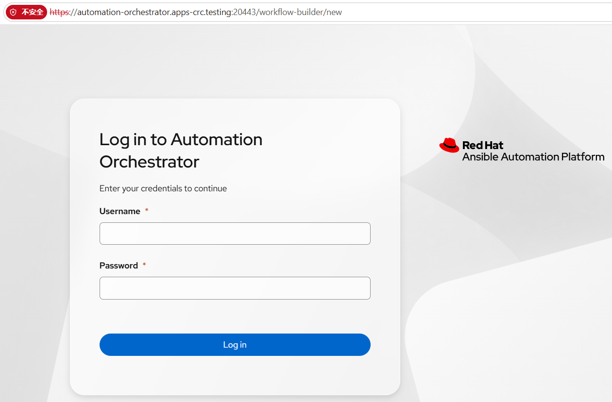

**Project Repository:**

[https://github.com/RedhatOfficial/aap-demo](https://github.com/RedhatOfficial/aap-demo)  
<br>
<br>

**Project Description:**

Deploy AAP to a local MicroShift cluster in minutes, is a LOCAL DEVELOPMENT tool and must NEVER be used in production.  
<br>
<br>

**Prerequisites:**

- CRC (OpenShift Local)

- 16 GB RAM minimum — default VM allocation is 16 GB (override with `CRC_MEMORY=24576 aap-demo create` for 24 GB)

- 16 CPU — during testing, when the CPU count was set to 8, certain scenarios caused Pods to fail to start due to insufficient CPU allocation

- 60 GB + disk space — for aap-operator deploy

- Pull secret — download from the Red Hat Hybrid Cloud Console (console.redhat.com)

- If deploying on a virtual machine, ensure hardware virtualization is enabled in the VM settings

- The following packages must be installed in advance: `libvirt-daemon`, `libvirt-daemon-driver-storage`, `libvirt-daemon-driver-network`, `qemu-kvm`

- Deployment must be performed as a non-root user (create a regular user `admin` and configure sudoers for privilege escalation)

- The system must be named in FQDN format, with `/etc/hosts` updated accordingly
<br>
<br>

**Step-by-Step Instructions:**

1. Visit: [https://console.redhat.com/openshift/create/local](https://console.redhat.com/openshift/create/local)

Download OpenShift Local and the pull secret first:


<br>


Location to save `pull-secret.txt`:

```
[root@aap-demo ~]# mkdir -p ~/.aap-demo

[root@aap-demo ~]# cd .aap-demo/
[root@aap-demo .aap-demo]# cat pull-secret.txt 
{"auths":{"cloud.openshift.com":{"auth":"xxxxxxxxxxxxxxxxxxxxxx","email":"jewang@redhat.com"}}}

```
<br>


2. Download and deploy the crc (OpenShift Local) installation tool:

```
[admin@aap-demo ~]$ git clone https://github.com/RedHatOfficial/aap-demo.git

[admin@aap-demo ~]$ cd aap-demo && ./install.sh

[admin@aap-demo ~]$ sudo cp crc-linux-*/crc /usr/local/bin/
```
<br>


3. Install and start crc:

```
[admin@aap-demo ~]$ crc setup
INFO Using bundle path /home/admin/.crc/cache/crc_libvirt_4.22.7_amd64.crcbundle 
INFO Checking if running as non-root              
INFO Checking if running inside WSL2              
INFO Checking if crc-admin-helper executable is cached 
INFO Checking if running on a supported CPU architecture 
INFO Checking if crc executable symlink exists    
INFO Checking minimum RAM requirements            
INFO Checking if Virtualization is enabled        
INFO Checking if KVM is enabled                   
INFO Checking if libvirt is installed             
INFO Checking if user is part of libvirt group    
INFO Adding user to libvirt group                 
INFO Using root access: Adding user to the libvirt group 
INFO Checking if active user/process is currently part of the libvirt group 
INFO Checking if libvirt daemon is running        
INFO Checking if a supported libvirt version is installed 
INFO Checking if crc-driver-libvirt is installed  
INFO Installing crc-driver-libvirt                
INFO Checking crc daemon systemd service          
INFO Setting up crc daemon systemd service        
INFO Checking crc daemon systemd socket units     
INFO Setting up crc daemon systemd socket units   
INFO Checking if vsock is correctly configured    
INFO Setting up vsock support                     
INFO Using root access: Setting CAP_NET_BIND_SERVICE capability for /usr/local/bin/crc executable 
INFO Using root access: Creating udev rule for /dev/vsock 
INFO Using root access: Changing permissions for /etc/udev/rules.d/99-crc-vsock.rules to 644  
INFO Using root access: Reloading udev rules database 
INFO Using root access: Loading vhost_vsock kernel module 
INFO Using root access: Creating file /etc/modules-load.d/vhost_vsock.conf 
INFO Using root access: Changing permissions for /etc/modules-load.d/vhost_vsock.conf to 644  
INFO Checking if CRC bundle is extracted in '$HOME/.crc' 
INFO Checking if /home/admin/.crc/cache/crc_libvirt_4.22.7_amd64.crcbundle exists 
INFO Getting bundle for the CRC executable        
INFO Downloading bundle: /home/admin/.crc/cache/crc_libvirt_4.22.7_amd64.crcbundle... 
5.81 GiB / 5.81 GiB [--------------------------------------------------------------------------------------------------------------------------------] 100.00% 180.59 MiB/s
INFO Uncompressing /home/admin/.crc/cache/crc_libvirt_4.22.7_amd64.crcbundle 
crc.qcow2:  21.06 GiB / 21.06 GiB [-------------------------------------------------------------------------------------------------------------------------------] 100.00%
oc:  129.79 MiB / 129.79 MiB [------------------------------------------------------------------------------------------------------------------------------------] 100.00%
Your system is correctly setup for using CRC. Use 'crc start' to start the instance

```
<br>


```
[admin@aap-demo ~]$ crc start
INFO Using bundle path /home/admin/.crc/cache/crc_libvirt_4.22.7_amd64.crcbundle 
INFO Checking if running as non-root              
INFO Checking if running inside WSL2              
INFO Checking if crc-admin-helper executable is cached 
INFO Checking if running on a supported CPU architecture 
INFO Checking if crc executable symlink exists    
INFO Checking minimum RAM requirements            
INFO Checking if Virtualization is enabled        
INFO Checking if KVM is enabled                   
INFO Checking if libvirt is installed             
INFO Checking if user is part of libvirt group    
INFO Checking if active user/process is currently part of the libvirt group 
INFO Checking if libvirt daemon is running        
INFO Checking if a supported libvirt version is installed 
INFO Checking if crc-driver-libvirt is installed  
INFO Checking crc daemon systemd socket units     
INFO Checking if vsock is correctly configured    
INFO Loading bundle: crc_libvirt_4.22.7_amd64...  
CRC requires a pull secret to download content from Red Hat.
You can copy it from the Pull Secret section of https://console.redhat.com/openshift/create/local.
? Please enter the pull secret             <-- paste the pull secret content here manually

WARN Cannot add pull secret to keyring: The name is not activatable 
INFO Creating CRC VM for OpenShift 4.22.7...      
INFO Generating new SSH key pair...               
INFO Generating new password for the kubeadmin user 
INFO Starting CRC VM for openshift 4.22.7...      
INFO CRC instance is running with IP 127.0.0.1    
INFO CRC VM is running                            
INFO Updating authorized keys...                  
INFO Configuring shared directories               
INFO Check internal and public DNS query...       
INFO Check DNS query from host...                 
INFO Verifying validity of the kubelet certificates... 
INFO Starting kubelet service                     
INFO Waiting for kube-apiserver availability... [takes around 2min] 
INFO Adding user's pull secret to the cluster...  
INFO Updating SSH key to machine config resource... 
INFO Overriding password for developer user       
INFO Changing the password for the users          
INFO Updating cluster ID...                       
INFO Updating root CA cert to admin-kubeconfig-client-ca configmap... 
INFO Starting openshift instance... [waiting for the cluster to stabilize] 
INFO 3 operators are progressing: openshift-controller-manager, operator-lifecycle-manager-packageserver, service-ca 
INFO 3 operators are progressing: authentication, image-registry, openshift-controller-manager 
INFO Operator authentication is progressing       
INFO All operators are available. Ensuring stability... 
INFO Operators are stable (2/3)...                
INFO Operators are stable (3/3)...                
INFO Waiting until the user's pull secret is written to the instance disk... 
INFO Adding crc-admin and crc-developer contexts to kubeconfig... 
Started the OpenShift cluster.

The server is accessible via web console at:
  https://console-openshift-console.apps-crc.testing

Log in as administrator:
  Username: kubeadmin
  Password: BSds6-nSzi2-mbB4W-fQISw

Log in as user:
  Username: developer
  Password: developer

Use the 'oc' command line interface:
  $ eval $(crc oc-env)
  $ oc login -u developer https://api.crc.testing:6443

```
<br>
<br>

4. Prepare NFS Storage Class:

Since AAP's Automation Hub uses an NFS-based Storage Class by default, NFS must be configured before running `aap-demo deploy`. Otherwise, the Hub-related Pods will fail to start.

If CRC is already running, it is recommended to reboot the virtual machine first. After reboot, CRC remains stopped, allowing NFS configuration to proceed. If you prefer not to reboot, manually stop CRC.

Assuming CRC is stopped, adjust CRC's core parameters to prevent resource exhaustion during deployment:

```
[admin@aap-demo ~]$ crc config set disk-size 60
[admin@aap-demo ~]$ crc config set memory 24576
[admin@aap-demo ~]$ crc config set cpus 8
```

<br>
Start CRC:

```
[admin@aap-demo ~]$ crc start
```
<br>


Export credentials template (optional):

```
[admin@aap-demo ~]$ export KUBECONFIG=~/.crc/machines/crc/kubeconfig
```
<br>

Note:

If you need to clean up a previously deployed CRC instance and reconfigure from scratch, follow these steps:

```
[admin@aap-demo ~]$ crc stop
[admin@aap-demo ~]$ crc cleanup

[admin@aap-demo ~]$ crc config set disk-size 60
[admin@aap-demo ~]$ crc config set memory 24576
[admin@aap-demo ~]$ crc config set cpus 8

[admin@aap-demo ~]$ crc setup
[admin@aap-demo ~]$ crc start

[admin@aap-demo ~]$ export KUBECONFIG=~/.crc/machines/crc/kubeconfig
```
<br>

Configure the built-in NFS service inside CRC:

```
[admin@aap-demo ~]$ ssh -i ~/.crc/machines/crc/id_ed25519 core@127.0.0.1 -p 2222 
[admin@aap-demo ~]$ sudo mkdir -p /var/srv/nfs/aap-hub 
[admin@aap-demo ~]$ sudo chmod 777 /var/srv/nfs/aap-hub 
[admin@aap-demo ~]$ echo '/var/srv/nfs/aap-hub *(rw,sync,no_subtree_check,no_root_squash)' | sudo tee /etc/exports 
[admin@aap-demo ~]$ sudo exportfs -a 
[admin@aap-demo ~]$ sudo systemctl enable --now nfs-server
```
<br>

Create the namespace and grant privileged SCC access:

```
[admin@aap-demo ~]$ kubectl create ns nfs-provisioner
[admin@aap-demo ~]$ kubectl label ns nfs-provisioner pod-security.kubernetes.io/enforce=privileged --overwrite
[admin@aap-demo ~]$ kubectl patch scc privileged --type='json' -p='[{"op": "add", "path": "/users/-", "value": "system:serviceaccount:nfs-provisioner:nfs-client-provisioner"}]'
```
<br>

Deploy the NFS Provisioner with full RBAC permissions and the `nfs-local-rwx` StorageClass:

```
[admin@aap-demo ~]$ kubectl apply -f - <<'EOF'
apiVersion: apps/v1
kind: Deployment
metadata:
  name: nfs-client-provisioner
  namespace: nfs-provisioner
spec:
  replicas: 1
  selector:
    matchLabels:
      app: nfs-client-provisioner
  template:
    metadata:
      labels:
        app: nfs-client-provisioner
    spec:
      serviceAccountName: nfs-client-provisioner
      containers:
        - name: nfs-client-provisioner
          image: registry.k8s.io/sig-storage/nfs-subdir-external-provisioner:v4.0.2
          securityContext:
            privileged: true
          volumeMounts:
            - name: nfs-client-root
              mountPath: /persistentvolumes
          env:
            - name: PROVISIONER_NAME
              value: k8s-sigs.io/nfs-subdir-external-provisioner
            - name: NFS_SERVER
              value: "127.0.0.1"
            - name: NFS_PATH
              value: "/var/srv/nfs/aap-hub"
      volumes:
        - name: nfs-client-root
          nfs:
            server: "127.0.0.1"
            path: "/var/srv/nfs/aap-hub"
---
apiVersion: v1
kind: ServiceAccount
metadata:
  name: nfs-client-provisioner
  namespace: nfs-provisioner
---
apiVersion: rbac.authorization.k8s.io/v1
kind: ClusterRole
metadata:
  name: nfs-client-provisioner-runner
rules:
  - apiGroups: [""]
    resources: ["nodes", "persistentvolumes", "persistentvolumeclaims", "storageclasses"]
    verbs: ["get", "list", "watch", "create", "delete", "update"]
  - apiGroups: [""]
    resources: ["events", "endpoints"]
    verbs: ["create", "update", "patch", "get", "list", "watch"]
  - apiGroups: ["coordination.k8s.io"]
    resources: ["leases"]
    verbs: ["get", "list", "watch", "create", "update", "patch"]
  - apiGroups: ["storage.k8s.io"]
    resources: ["storageclasses"]
    verbs: ["get", "list", "watch"]
---
apiVersion: rbac.authorization.k8s.io/v1
kind: ClusterRoleBinding
metadata:
  name: run-nfs-client-provisioner
subjects:
  - kind: ServiceAccount
    name: nfs-client-provisioner
    namespace: nfs-provisioner
roleRef:
  kind: ClusterRole
  name: nfs-client-provisioner-runner
  apiGroup: rbac.authorization.k8s.io
---
apiVersion: storage.k8s.io/v1
kind: StorageClass
metadata:
  name: nfs-local-rwx
provisioner: k8s-sigs.io/nfs-subdir-external-provisioner
reclaimPolicy: Delete
allowVolumeExpansion: true
EOF
```
<br>

Remove the Default annotation from the built-in StorageClass and set NFS as the sole default:

Remove the default annotation from the built-in StorageClass:

```
[admin@aap-demo ~]$ kubectl patch storageclass crc-csi-hostpath-provisioner -p '{"metadata": {"annotations":{"storageclass.kubernetes.io/is-default-class":"false"}}}'
```
<br>

Set `nfs-local-rwx` as the only global default StorageClass:

```
[admin@aap-demo ~]$ kubectl patch storageclass nfs-local-rwx -p '{"metadata": {"annotations":{"storageclass.kubernetes.io/is-default-class":"true"}}}'
```
<br>

Remove any potential node Taints to ensure unobstructed scheduling:

```
[admin@aap-demo ~]$ kubectl uncordon crc
```
<br>

Verify the Pod is in Running state:

```
[admin@aap-demo ~]$ kubectl get pods -n nfs-provisioner
NAME                                      READY   STATUS    RESTARTS   AGE
nfs-client-provisioner-649769b78d-zqb76   1/1     Running   0          9h

```
<br>

Verify the StorageClass status is as follows:

```
[admin@aap-demo ~]$ kubectl get sc
NAME                           PROVISIONER                                   RECLAIMPOLICY   VOLUMEBINDINGMODE      ALLOWVOLUMEEXPANSION   AGE
crc-csi-hostpath-provisioner   kubevirt.io.hostpath-provisioner              Retain          WaitForFirstConsumer   false                  25d
nfs-local-rwx (default)        k8s-sigs.io/nfs-subdir-external-provisioner   Delete          Immediate              true                   9h
```
<br>
<br>

5. Install aap-demo:

Install `operator-sdk` in the environment:

```
[admin@aap-demo ~]$ export CURL_CA_BUNDLE=""
[admin@aap-demo ~]$ echo 'insecure' >> ~/.curlrc
```
<br>


Run the aap-demo deployment:

```
[admin@aap-demo ~]$ aap-demo deploy
```
<br>

After deployment, check the status with:

```
[admin@aap-demo ~]$ aap-demo status

AAP Demo Status
===============
Tool:        1.0.3 (856aad9)
Built:       2026-08-21T14:19:25-05:00

Infra:       OpenShift Local (CRC)
Cluster:     running (crc-microshift)

TLS:
----
  Ingress CA file:   /home/admin/.aap-demo/crc-ingress-ca.crt
  System trust:      trusted
  Browser trust:     unknown (install nss-tools for Chrome/Firefox)

Kubeconfig:  /home/admin/.crc/machines/crc/kubeconfig
Source:      /home/admin/aap-demo (branch: main)
Repo:        https://github.com/RedHatOfficial/aap-demo.git

VM:
---
  OS:           Red Hat Enterprise Linux release 9.8 (Plow)
  OpenShift:    
  CPUs:         8
  Memory:       15Gi / 23Gi (8.0Gi available)
  Load:         2.49 2.63 1.99
  Disk:         39G/100G (39% used)

Namespaces:
-----------
  aap-operator                   26/26 pods   aap
  automation-orchestrator        1/1 pods
  hostpath-provisioner           1/1 pods
  nfs-provisioner                1/1 pods

AAP Deployments:
----------------
  https://aap-aap-operator.apps-crc.testing
  https://aap-mcp-aap-operator.apps.127.0.0.1.nip.io

Credentials:
------------
  aap-operator:        admin / MnNWItHbbLC6862JG5gNT7LgAujuOsPf


Addons:
-------
  mcp-server      enabled
  portal          disabled
  setup-pah       disabled
  ao              enabled
  apme-eap        disabled
  local-cache     disabled
  product-demos   disabled
  product-demo-satellite disabled

```
<br>
<br>

Note:

During deployment, you may find that the deployment has actually completed, but no success message is shown and the terminal remains occupied.

In this case, first check the aap-operator deployment progress with the following command to confirm that the Ansible tasks have finished:

```
[admin@aap-demo ~]$ kubectl logs -n aap-operator deployment/resource-operator-controller-manager -c manager --tail=50 -f
```
<br>

Alternatively, run `aap-demo status` to confirm the status, ensuring all Pods are in Running state:

```
......
Namespaces:
-----------
  aap-operator                   26/26 pods   aap
  automation-orchestrator        1/1 pods
  hostpath-provisioner           1/1 pods
  nfs-provisioner                1/1 pods
......
```
<br>

At this point you can run the following command to force the Operator to refresh its status. If all Pods are healthy but the Condition has not been updated, add a harmless annotation to the main CR to force the Operator to recheck and mark the status as Successful:

```
[admin@aap-demo ~]$ kubectl annotate ansibleautomationplatform --all -n aap-operator force-reconcile=$(date +%s) --overwrite
```
<br>

6. Access the aap-demo environment:

The access links for the aap-demo environment are obtained via `aap-demo status`:

```
AAP Deployments:
----------------
  https://aap-aap-operator.apps-crc.testing                    <-- AAP access URL
  https://aap-mcp-aap-operator.apps.127.0.0.1.nip.io
```
<br>
Note that access must be via the hostname. If accessing through an SSH tunnel via a bastion host, update the hosts file on the client machine. For example, on a Windows machine:

```
127.0.0.1  aap-aap-operator.apps-crc.testing
```
<br>

Establish the tunnel from the terminal:

```
C:\Users\jerrywjl>ssh -L 10443:192.168.72.90:443 lab-user@bastion-2vvct.cluster-2vvct.dyn.redhatworkshops.io
```
<br>

The access URL is then:

```
https://aap-aap-operator.apps-crc.testing:10443
```
<br>

The default username for the first login is `admin`. The admin password can be obtained via `aap-demo status`:

```
......
Credentials:
------------
  aap-operator:        admin / MnNWItHbbLC6862JG5gNT7LgAujuOsPf
......
```
<br>

Or by running:

```
[admin@aap-demo ~]$ kubectl get secret -n aap-operator -o json | jq -r '.items[] | select(.metadata.name | contains("admin-password")) | "\(.metadata.name): " + (.data.password // .data.admin_password | @base64d)'
aap-admin-password: MnNWItHbbLC6862JG5gNT7LgAujuOsPf
aap-controller-admin-password: yfDXshRSMaknCGRNwBfeJBU5TonAS4jf
aap-eda-admin-password: 7WvWVTzcc3aXLjaSPFHaGamyPb5vTgM4
aap-hub-admin-password: yXCOZqyKpjGDROcKcmpdcFuDTMocS1tT

```
<br>
<br>
7. Enable aap-demo Add-ons:

aap-demo includes the following add-ons, which can be enabled or disabled via command:

```
aap-demo enable              # List all addons
aap-demo enable portal       # Installs Automation Portal
aap-demo enable setup-pah    # Configures Private Automation Hub Credentials
aap-demo enable mcp-server   # MCP server for AI assistants
aap-demo enable ao           # Automation Orchestrator (GA; no aapctl required — see addons/ao/README.md)
aap-demo enable apme-eap     # Early Access Program only for APME
aap-demo enable local-cache  # Caches AAP containers locally so you don't re-download after destroy/create

# Ansible Product Demos - Official demo content from ansible/product-demos
aap-demo enable product-demos                # Five domains at once (includes base; Satellite opt-in)
aap-demo enable product-demo-satellite       # Satellite demos (requires a Satellite server)
aap-demo disable addon_name                  # Disables addon

```
<br>

However, running `aap-demo enable ao` (Automation Orchestrator) produces the following error:

```
[admin@aap-demo ~]$ aap-demo enable ao
Enabling addon: ao
  Source: /home/admin/aap-demo/addons/ao/deploy.sh (1.0.3 (856aad9))
Creating namespace and SCC grants...
namespace/automation-orchestrator created
✓ Namespace ready
Checking AAP redhat-operators catalog (for index image and pull secret)...
Creating AO CatalogSource in automation-orchestrator...
  Index: redhat/redhat-operator-index:v4.22
  Ensuring MicroShift 4.22+ signature policy allows registry.redhat.io...
  Container signature policy already relaxed
secret/redhat-operators-pull-secret created
catalogsource.operators.coreos.com/redhat-operators created
  Waiting for CatalogSource READY...
✓ CatalogSource READY
  Waiting for operator index to sync...

✓ automation-orchestrator-operator found in catalog
✓ Operator package found in AO catalog (automation-orchestrator, stable)
✓ Ingress host: automation-orchestrator.apps-crc.testing
✓ CloudNativePG operator ready
Creating PostgreSQL cluster for Automation Orchestrator...
secret/orchestrator-postgres-secret created
secret/temporal-postgres-secret created
secret/temporal-visibility-postgres-secret created
database.postgresql.cnpg.io/orchestrator created
database.postgresql.cnpg.io/temporal created
database.postgresql.cnpg.io/temporal-visibility created
Error from server (InternalError): error when creating "STDIN": Internal error occurred: failed calling webhook "mcluster.cnpg.io": failed to call webhook: Post "https://cnpg-webhook-service.cnpg-system.svc:443/mutate-postgresql-cnpg-io-v1-cluster?timeout=10s": no endpoints available for service "cnpg-webhook-service"
ERROR: Failed to apply PostgreSQL manifests.

```
<br>

Root cause:

When enabling Automation Orchestrator (ao) in an OpenShift/CRC environment, the core blocker is the missing installation and permissions of the CloudNativePG (CNPG) database operator.

The specific causes include:

Webhook timeout hang:

  - Symptom: Running `aap-demo enable ao` throws `failed calling webhook "mcluster.cnpg.io": no endpoints available`.

  - Cause: Stale CNPG webhook validation configurations remain in the cluster, but no actual CNPG Operator Pods are running in the `cnpg-system` namespace.

Database Cluster fails to be created:

  - Symptom: After cleaning up the webhook and retrying, the process hangs at `PostgreSQL cluster not ready after 10 minutes`.

  - Cause: The CNPG operator is not actually deployed and running, so the submitted `orchestrator-postgres` database resource has no controller and no underlying database Pod is created.

CNPG Deployment progress deadline exceeded:

  - Symptom: After manually deploying CNPG, `cnpg-controller-manager` reports `exceeded its progress deadline`.

  - Cause: OpenShift's Security Context Constraints (SCC) block the CNPG ServiceAccount, and the `oc` command is not installed in the current terminal, causing standard `oc adm` authorization to fail.
<br>

Resolution:

Clean up stale CNPG Webhook configurations:

```
[admin@aap-demo ~]$ kubectl delete mutatingwebhookconfiguration -l app.kubernetes.io/name=cloudnative-pg --ignore-not-found
[admin@aap-demo ~]$ kubectl delete validatingwebhookconfiguration -l app.kubernetes.io/name=cloudnative-pg --ignore-not-found
```
<br>
<br>
Install the CNPG Operator and grant OpenShift Privileged SCC:

Create the namespace and label it for privileged enforcement:
```
[admin@aap-demo ~]$ kubectl create ns cnpg-system --dry-run=client -o yaml | kubectl apply -f -
[admin@aap-demo ~]$ kubectl label ns cnpg-system pod-security.kubernetes.io/enforce=privileged --overwrite
```
<br>

Deploy the CNPG operator (v1.22.1):
```
[admin@aap-demo ~]$ kubectl apply -f https://raw.githubusercontent.com/cloudnative-pg/cloudnative-pg/release-1.22/releases/cnpg-1.22.1.yaml
```
<br>

Patch OpenShift SCC privileges directly using kubectl:
```
[admin@aap-demo ~]$ kubectl patch scc privileged --type='json' -p='[{"op": "add", "path": "/users/-", "value": "system:serviceaccount:cnpg-system:cnpg-manager"}]' --ignore-not-found
```
<br>

Restart and wait for the CNPG Operator to reach Ready state:
```
[admin@aap-demo ~]$ kubectl rollout restart deployment cnpg-controller-manager -n cnpg-system
[admin@aap-demo ~]$ kubectl rollout status deployment/cnpg-controller-manager -n cnpg-system --timeout=120s
```
<br>

Re-run the add-on after the above steps complete:
```
[admin@aap-demo ~]$ aap-demo enable ao
```
<br>

Access the AO Portal using the information from the deployment output:
```
........

✓ Automation Orchestrator operator and instance applied

  URL:      https://automation-orchestrator.apps-crc.testing
  Username: admin
  Password: ykAi5xd03lj3lTMo8TAlmpcOEsr/hyN/
  Status:   kubectl get pods -n automation-orchestrator
  Saved to config: ADDONS=mcp-server,ao

```

<br>
<br>
Access AO via SSH tunnel:

First update the client hosts file:

```
127.0.0.1  aap-aap-operator.apps-crc.testing  automation-orchestrator.apps-crc.testing
```
<br>
<br>

Establish the tunnel:
```
C:\Users\jerrywjl>ssh -L 20443:192.168.72.90:443 lab-user@bastion-2vvct.cluster-2vvct.dyn.redhatworkshops.io
```
<br>
<br>
Access the AO portal at:
```
https://automation-orchestrator.apps-crc.testing:20443
```


<br>

Enable the portal add-on:
```
[admin@aap-demo ~]$ curl -fsSL https://raw.githubusercontent.com/helm/helm/main/scripts/get-helm-3 | bash
Downloading https://get.helm.sh/helm-v3.21.4-linux-amd64.tar.gz
Verifying checksum... Done.
Preparing to install helm into /usr/local/bin
helm installed into /usr/local/bin/helm

[admin@aap-demo ~]$ helm version --short
v3.21.4+g813176c

[admin@aap-demo ~]$ aap-demo enable portal
Enabling addon: portal
  Source: /home/admin/aap-demo/addons/portal/deploy.sh (1.0.3 (856aad9))
Checking prerequisites...
✓ Cluster architecture: amd64
✓ Using x86 profile (Red Hat RHDH images)
✓ Prerequisites met
Setting up portal namespace: redhat-rhaap-portal
namespace/redhat-rhaap-portal created
namespace/redhat-rhaap-portal labeled
clusterrolebinding.rbac.authorization.k8s.io/system:openshift:scc:anyuid:redhat-rhaap-portal created
clusterrolebinding.rbac.authorization.k8s.io/system:openshift:scc:privileged:redhat-rhaap-portal created
secret/redhat-operators-pull-secret created
serviceaccount/default patched
✓ Portal namespace ready
Fetching AAP credentials...
✓ AAP accessible at: aap-aap-operator.apps-crc.testing
Selecting AAP organization...
✓ Using organization: Default (ID: 1)
Creating OAuth application in AAP...
✓ OAuth app ready (ID: 1)
Enabling OAuth token creation for external users...
✓ OAuth tokens enabled
Generating AAP API token...
✓ API token generated
Configuring registry credentials...
✓ Using existing registry.redhat.io credentials from cluster
Creating registry secret in OpenShift...
secret/redhat-rhaap-portal-dynamic-plugins-registry-auth created
✓ Registry secret created
Getting cluster information...
✓ Cluster base URL: apps-crc.testing
Creating AAP credentials secret...
secret/secrets-rhaap-portal created
✓ AAP credentials secret created
✓ AAP host URL: https://aap-aap-operator.apps-crc.testing
Creating Helm values file...
✓ Helm values created (x86 profile)
Installing Helm chart...
Adding OpenShift Helm Charts repository...
"openshift-helm-charts" has been added to your repositories
Installing Helm release...
NAME: redhat-rhaap-portal
LAST DEPLOYED: Sun Aug 23 23:27:57 2026
NAMESPACE: redhat-rhaap-portal
STATUS: deployed
REVISION: 1
TEST SUITE: None
✓ Helm chart installed
Waiting for portal deployment to be ready...
Waiting for deployment "redhat-rhaap-portal" rollout to finish: 0 out of 1 new replicas have been updated...
Waiting for deployment "redhat-rhaap-portal" rollout to finish: 0 of 1 updated replicas are available...
⚠️  Deployment taking longer than expected
Check status with: kubectl get pods -n redhat-rhaap-portal
Proceeding anyway...
Updating OAuth redirect URI...
✓ OAuth redirect URI updated: https://redhat-rhaap-portal-redhat-rhaap-portal.apps-crc.testing/api/auth/rhaap/handler/frame
Verifying AAP host URL in portal pod...
⚠️  Could not read AAP_HOST_URL from portal pod
⚠️  AAP host URL verification failed (portal may still work)
Verifying OAuth client credentials...
❌ Portal pod cannot reach AAP token endpoint at https://aap-aap-operator.apps-crc.testing/o/token/
   On CRC/MicroShift, nip.io resolves to 127.0.0.1 inside pods.
   Re-run: aap-demo enable portal
⚠️  OAuth client verification failed (portal may still work)

━━━━━━━━━━━━━━━━━━━━━━━━━━━━━━━━━━━━━━━━━━━━━━━━━━━━━━━━━━━━
✓ Portal addon enabled successfully!
━━━━━━━━━━━━━━━━━━━━━━━━━━━━━━━━━━━━━━━━━━━━━━━━━━━━━━━━━━━━

Portal URL: https://redhat-rhaap-portal-redhat-rhaap-portal.apps-crc.testing
Profile: x86 (Red Hat RHDH hub image from chart)


Next steps:
1. Open the portal URL in your browser
2. Click 'Sign In'
3. Authenticate with AAP credentials (admin / <aap-admin-password>)
4. Browse AAP job templates in the catalog

Check status: aap-demo status portal
Disable: aap-demo disable portal

  Saved to config: ADDONS=mcp-server,ao,portal 
```
<br>

Although the portal add-on was enabled successfully, there is one error:

```
Verifying OAuth client credentials...
❌ Portal pod cannot reach AAP token endpoint at https://aap-aap-operator.apps-crc.testing/o/token/
   On CRC/MicroShift, nip.io resolves to 127.0.0.1 inside pods.
   Re-run: aap-demo enable portal
⚠️  OAuth client verification failed (portal may still work)
```
<br>

There are two main causes:

CRC/MicroShift internal DNS resolution deadlock: The Portal Pod attempts to connect to the AAP OAuth endpoint from inside the container. In a CRC/MicroShift environment, `nip.io` resolves to `127.0.0.1` inside Pods, which points back to the Pod itself rather than to the actual Ingress router — causing the connection to fail.


CRC node CPU resource contention (Pod Pending): The Portal requests a relatively high CPU quota by default, which can easily trigger `Insufficient cpu` on a single-node CRC environment, leaving the new Pod stuck in Pending.


Apply the following fixes for the CRC environment:

1. Reduce CPU request quota to resolve the Pending scheduling issue
```
[admin@aap-demo ~]$ kubectl patch deployment redhat-rhaap-portal -n redhat-rhaap-portal --type='json' -p='[
  {"op": "replace", "path": "/spec/template/spec/containers/0/resources/requests/cpu", "value": "100m"},
  {"op": "replace", "path": "/spec/template/spec/initContainers/0/resources/requests/cpu", "value": "100m"}
]'
```
<br>

2. Inject hostAliases to force-map the AAP domain to the cluster's internal Ingress Router ClusterIP (10.217.4.100)
```
[admin@aap-demo ~]$ kubectl patch deployment redhat-rhaap-portal -n redhat-rhaap-portal --type='json' -p='[
  {"op": "add", "path": "/spec/template/spec/hostAliases", "value": [
    {"ip": "10.217.4.100", "hostnames": ["aap-aap-operator.apps-crc.testing"]}
  ]}
]'
```
<br>

3. Wait for the rolling update to complete
```
[admin@aap-demo ~]$ kubectl rollout status deployment/redhat-rhaap-portal -n redhat-rhaap-portal --timeout=120s
```
<br>

4. Confirm the Pod is in 2/2 Running state:
```
[admin@aap-demo ~]$ kubectl get pods -n redhat-rhaap-portal 
NAME                                   READY   STATUS    RESTARTS   AGE
redhat-rhaap-portal-7cd8cf9464-n9dp7   2/2     Running   0          7m33s
redhat-rhaap-portal-postgresql-0       1/1     Running   0          8m28s
```
<br>

5. Verify that the container can reach the AAP OAuth endpoint internally (HTTP 405 means the connection is fully working):
```
[admin@aap-demo ~]$ kubectl exec -n redhat-rhaap-portal deployment/redhat-rhaap-portal -- curl -k -s -o /dev/null -w "%{http_code}\n" https://aap-aap-operator.apps-crc.testing/o/token/
Defaulted container "backstage-backend" out of: backstage-backend, ansible-devtools-server, install-dynamic-plugins (init)
405
```


A return value of 405 indicates success.
