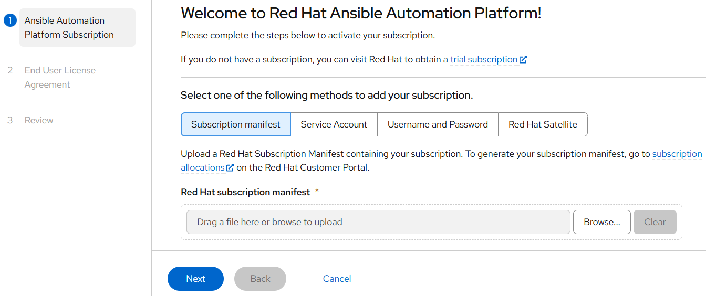
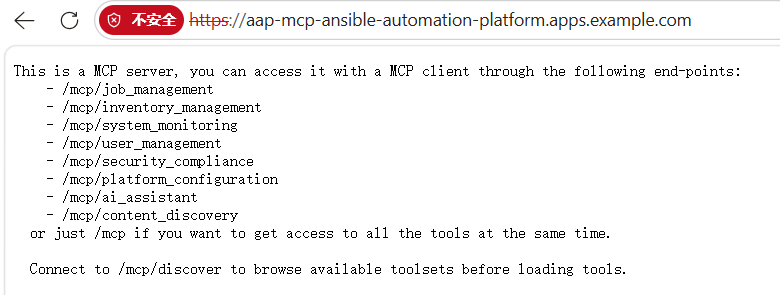
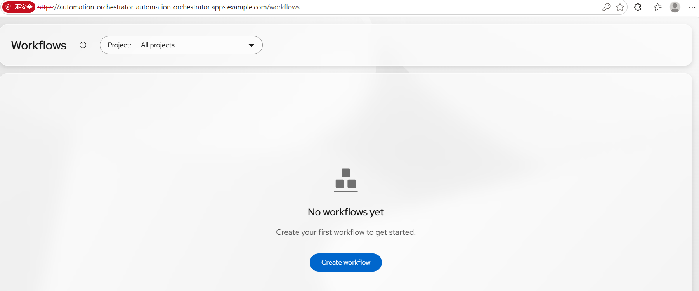

**背景：**

AAP 2.7新增了Automation Orchestrator（AO）功能，但该功能需要由OpenShift架构（以Operator方式）提供。这就导致如果要按以往方式通过Container Base安装了AAP，还要再去部署一个OCP再去安装AO的Operator。针对国内客户来说，无论从POC还是从客户实际使用场景来看这都非常不现实。

针对这种情况一个比较可行的方案是使用Microshift，红帽针对边缘场景提供的一个轻量级的OCP环境。MicroShift可以理解为可以部署在单机上的轻量级精简版的OCP集群。仅通过MS提供一个基础平台，然后在该平台上以Operator方式安装AAP以及AO。

这样做既满足了AAP和AO的部署需求，同时也能继续保持以前的单节点架构，而且不会产生过度的资源开销。但使用该方式意味着AAP的部署方式产生了彻底变化，新增大量额外的部署和配置，且如果客户环境如果不能出外网（大多数）的情况下会比较头疼。

本文尽可能完整记录Microshift，AAP，AO，MCP等各种常用组件的安装部署过程，在后面的实际使用过程中再考虑如何优化和解决实际问题。

**环境准备：**

- RHEL 9.6虚拟机，8CPU，32G内存，80G磁盘+100G磁盘；

- 关闭和禁用防火墙与SELinux；

- 更新/etc/hosts，添加IP地址和主机FQDN的对应；

- 创建普通用户admin，并更新/etc/sudoers文件免密码提权至root；

- RHEL 9.6安装默认后根分区位于rhel卷组，通过vgscan将新增磁盘扩展进rhel卷组，但不要扩展根分区以及新增逻辑卷；

（MicroShift 使用逻辑卷管理器存储 (LVMS) 容器存储接口 (CSI) 插件为持久卷 (PV) 提供存储。LVMS 依赖于 Linux 逻辑卷管理器 (LVM) 来动态管理 PV 的底层逻辑卷 (LV)。因此，您的机器必须有一个包含未使用空间的 LVM 卷组 (VG)，LVMS 可以在其中创建工作负载 PV 所需的 LV。

要配置允许 LVMS 为工作负载 PV 创建 LV 的卷组 (VG)，请在安装 RHEL 时降低根卷的“所需大小”。降低根卷的大小可以为 LVMS 在运行时创建的额外 LV 提供磁盘上的未分配空间。）

```
[root@localhost ~]# hostnamectl set-hostname microshift.example.com

[root@localhost ~]# pvcreate /dev/sdb
Physical volume "/dev/sdb" successfully created.

[root@localhost ~]# vgscan
Found volume group "rhel" using metadata type lvm2

[root@localhost ~]# vgextend rhel /dev/sdb
Volume group "rhel" successfully extended
```

- 将本机注册到RHN，并enable相关的repo，同时锁定操作系统版本：

```
[root@microshift ~]# subscription-manager register --auto-attach

[root@microshift ~]# subscription-manager repos --enable rhocp-4.22-for-rhel-9-$(uname -m)-rpms --enable fast-datapath-for-rhel-9-$(uname -m)-rpms

[root@microshift ~]# subscription-manager release --set=9.6
```

- 下载microshift以及oc软件包：

```
[root@microshift ~]# yum install -y microshift openshift-clients
```

- 获得pull-secret：

登录  页面下载 Pull Secret，将下载的文件保存到本机（~/pull-secret.txt）并配置（切换至admin用户身份执行）：

```
[admin@microshift ~]$ cat pull-secret.txt 
{"auths":{"cloud.openshift.com":{"auth":"b3BlbnNoaWZ0LXJlbGVhc2UtZGV2K29jbV9hY2Nlc3NfY2VlOGRmODk0Nzc2NGM3NWE5NjI2NjNmYjI1YjVlZmQ6U1NTMU8xM1ZMVEdOWVM4VElHWkNYS1ZIWUlYSEQ3UzBONldDWDdUSjlRWkEzMzBRN0g4UFE0SEoxSjJNU1lKWQ==","email":"jewang@redhat.com"},"quay.io":{"auth":"b3BlbnNoaWZ0LXJlbGVhc2UtZGV2K29jbV9hY2Nlc3NfY2VlOGRmODk0Nzc2NGM3NWE5NjI2NjNmYjI1YjVlZmQ6U1NTMU8xM1ZMVEdOWVM4VElHWkNYS1ZIWUlYSEQ3UzBONldDWDdUSjlRWkEzMzBRN0g4UFE0SEoxSjJNU1lKWQ==","email":"jewang@redhat.com"},"registry.connect.redhat.com":{"auth":"NTM0MjM3MTN8dWhjLTFlckN4dzg1N0ptbVJQbTNLVmlsVG5JUmF4TjpleUpoYkdjaU9pSlNVelV4TWlKOS5leUp6ZFdJaU9pSmpZVGc0WXpaaU1qWTNPREEwT0RKbVlUVTNNRGd3WkdZd01tSTFNREEyTWlKOS5TQUhvLTRVTFlkM05qQlV6U0dSR2xSV3ZTZGE1Tk1CcmcybUVueWQ4bHgyaWhGZHFGejdfZFZ3MWRhbXRwZjdGTzlNV2dZNDhwTjhPSkJUdGV6aElIOTV6akY0RDRRNHZOZHBNckI0V0hlUkY2Qmh6WWg4aWdDVmpGVjdKQzY3cTBKZ3cya3NMcU82U0R6VVRBOXdyTnNZdmhOOGMtUWxOSFl5T2N5WDBvajZzNW43Y1VacVlIcVg4RzlyS3BSSWVnY1hITXVLS2dxRU9fS18ycVBET1RPYkNtMU5JZFR0Vm5wbUltRDA1ZUdEZGdGbzJSbjdVajcxcDZVQ0NNeHJkbGxucEY4T3hSeVp5bU5KMlpPQ0NFNWxoZGRZa2luMGRSU2ZkckFEaExILWVUMGtBaXFrTC1DdVFqRTR0NzdRMjhqUkFjcXlFNkIzWU84am5vVkhEZ1VnQnp6UFk1aGY0eXNQc1V3Y08yRWM0aGsyLXhKZXNUUm9PVG5Bd2t3cFJRNHBCOFVmb3lBZFJJeTMzUTZNUGwwXzFHblRLZFFvb3V3WHJ1SW56bEhlVHpDck9XNno2S3lCTDRhYlZyQnFVam1yMktQcWJmcFk3TUkyUHFjbTdNLU9fcU1QMEctXzhzUDJDcjdfZ0N1Z2JJVUFkSHpXQXA2WXZwMXFrVFVNa2lFdzFmWkNHTXFkaXFmMzd3WUJwamlFT29uVkU4MkVTdEl0aE00cnBtUXRBQi1rSU1nUUNfTEtYTVZBT2VRM0owa3RWUHJjc1VuamtZZWU4OGZUVGI1Q0c2NjJjODJNaTZldHhuektXRnQxTG1QWFRna3hfRnZnX2lacEkyUVFPMWxXcm12WjZxWWZMNUdWMWlHUFRQekRPeGhDOGZXbnlYaE9DWlhzMWR5QQ==","email":"jewang@redhat.com"},"registry.redhat.io":{"auth":"NTM0MjM3MTN8dWhjLTFlckN4dzg1N0ptbVJQbTNLVmlsVG5JUmF4TjpleUpoYkdjaU9pSlNVelV4TWlKOS5leUp6ZFdJaU9pSmpZVGc0WXpaaU1qWTNPREEwT0RKbVlUVTNNRGd3WkdZd01tSTFNREEyTWlKOS5TQUhvLTRVTFlkM05qQlV6U0dSR2xSV3ZTZGE1Tk1CcmcybUVueWQ4bHgyaWhGZHFGejdfZFZ3MWRhbXRwZjdGTzlNV2dZNDhwTjhPSkJUdGV6aElIOTV6akY0RDRRNHZOZHBNckI0V0hlUkY2Qmh6WWg4aWdDVmpGVjdKQzY3cTBKZ3cya3NMcU82U0R6VVRBOXdyTnNZdmhOOGMtUWxOSFl5T2N5WDBvajZzNW43Y1VacVlIcVg4RzlyS3BSSWVnY1hITXVLS2dxRU9fS18ycVBET1RPYkNtMU5JZFR0Vm5wbUltRDA1ZUdEZGdGbzJSbjdVajcxcDZVQ0NNeHJkbGxucEY4T3hSeVp5bU5KMlpPQ0NFNWxoZGRZa2luMGRSU2ZkckFEaExILWVUMGtBaXFrTC1DdVFqRTR0NzdRMjhqUkFjcXlFNkIzWU84am5vVkhEZ1VnQnp6UFk1aGY0eXNQc1V3Y08yRWM0aGsyLXhKZXNUUm9PVG5Bd2t3cFJRNHBCOFVmb3lBZFJJeTMzUTZNUGwwXzFHblRLZFFvb3V3WHJ1SW56bEhlVHpDck9XNno2S3lCTDRhYlZyQnFVam1yMktQcWJmcFk3TUkyUHFjbTdNLU9fcU1QMEctXzhzUDJDcjdfZ0N1Z2JJVUFkSHpXQXA2WXZwMXFrVFVNa2lFdzFmWkNHTXFkaXFmMzd3WUJwamlFT29uVkU4MkVTdEl0aE00cnBtUXRBQi1rSU1nUUNfTEtYTVZBT2VRM0owa3RWUHJjc1VuamtZZWU4OGZUVGI1Q0c2NjJjODJNaTZldHhuektXRnQxTG1QWFRna3hfRnZnX2lacEkyUVFPMWxXcm12WjZxWWZMNUdWMWlHUFRQekRPeGhDOGZXbnlYaE9DWlhzMWR5QQ==","email":"jewang@redhat.com"}}}

```

```
[root@microshift ~]$ sudo cp ~/pull-secret.txt /etc/crio/openshift-pull-secret

[root@microshift ~]$ sudo chown admin:admin /etc/crio/openshift-pull-secret
[root@microshift ~]$ sudo chmod 644 /etc/crio/openshift-pull-secret
```

- 国内网络环境中需要配置microshift服务通过代理获取各种镜像：

```
[root@microshift ~]$ sudo mkdir -p /etc/systemd/system/crio.service.d

[root@microshift ~]$ cat <<EOF | sudo tee /etc/systemd/system/crio.service.d/HTTP-PROXY.conf
[Service]
Environment="HTTP_PROXY=http://10.210.65.9:10000"
Environment="HTTPS_PROXY=http://10.210.65.9:10000"
Environment="NO_PROXY=localhost,127.0.0.1,.cluster.local,.svc,10.42.0.0/16,169.254.169.1,microshift.example.com"
EOF
```

- 在 /etc/profile.d/ 下新建代理脚本，确保所有用户和系统服务登录时都能生效：

```
[root@microshift ~]$ cat <<'EOF' | sudo tee /etc/profile.d/proxy.sh
export http_proxy="http://10.210.65.9:10000"
export https_proxy="http://10.210.65.9:10000"
export HTTP_PROXY="http://10.210.65.9:10000"
export HTTPS_PROXY="http://10.210.65.9:10000"
export no_proxy="localhost,127.0.0.1,.cluster.local,.svc,10.42.0.0/16,169.254.169.1,10.210.65.8,microshift.example.com"
export NO_PROXY="localhost,127.0.0.1,.cluster.local,.svc,10.42.0.0/16,169.254.169.1,10.210.65.8,microshift.example.com"
EOF


[root@microshift ~]$ sudo chmod +x /etc/profile.d/proxy.sh
[root@microshift ~]$ source /etc/profile.d/proxy.sh
```

**安装与部署（1）—— 部署Microshift与OLM：**

- 重新启动和加载服务：

```
[root@microshift ~]$ sudo systemctl daemon-reload
[root@microshift ~]$ sudo systemctl restart crio
[root@microshift ~]$ sudo systemctl enable crio --now
[root@microshift ~]$ sudo systemctl enable microshift --now
```

- 配置 oc / kubectl 命令行工具访问：

```
[root@microshift ~]$ mkdir -p ~/.kube

[root@microshift ~]$ sudo cat /var/lib/microshift/resources/kubeadmin/kubeconfig > ~/.kube/config
[root@microshift ~]$ chmod 600 ~/.kube/config
```

- 在microshift启动运行过程中相关的Pod会被拉起，可通过以下命令确认：

```
[admin@microshift ~]$ oc get nodes
[admin@microshift ~]$ oc get pods -A

```

例如：

```
[admin@microshift ~]$ oc get nodes
NAME                     STATUS   ROLES                         AGE    VERSION
microshift.example.com   Ready    control-plane,master,worker   4m4s   v1.35.6


[admin@microshift ~]$ oc get pods -A 
NAMESPACE                  NAME                                       READY   STATUS    RESTARTS   AGE
kube-system                csi-snapshot-controller-5b6dcfcc77-5xwrp   1/1     Running   0          3m21s
openshift-dns              dns-default-qhdqd                          2/2     Running   0          110s
openshift-dns              node-resolver-q2nbv                        1/1     Running   0          3m17s
openshift-ingress          router-default-67dcc99b4f-vx5bb            1/1     Running   0          3m18s
openshift-ovn-kubernetes   ovnkube-master-9pxsj                       5/5     Running   0          3m17s
openshift-ovn-kubernetes   ovnkube-node-t266p                         1/1     Running   0          3m17s
openshift-service-ca       service-ca-7cd8fbb87-hx2l5                 1/1     Running   0          3m21s
openshift-storage          lvms-operator-5fbfcd5b9-zwcht              1/1     Running   0          3m19s
openshift-storage          vg-manager-8r8mt                           1/1     Running   0          20s

```

**注意：**

如果有某些Pod处于pending状态，可用kubectl describe命令查看具体的event。由于microshift是一个独立节点，有时候节点可能会因为各种原因被Taint而导致无法调度Pod的创建。例如：

```
Node-Selectors: node-role.kubernetes.io/master=
Events: 0/1 nodes are available: 1 node(s) had untolerated taint(s).
```

事实上，在 MicroShift 中，引发 CNI/OVN 网络插件卡死的最常见原因有三个：

系统防火墙未放行 OVN 网桥、CRIO 网络接口没初始化、以及 主机名解析不匹配。

针对这种情况可使用以下方式去除Taint：

```
# 1. 获取节点名称
oc get nodes

# 2. 查看节点的 Taints 和 Labels（替换 <node-name> 为实际节点名，如 microshift.demo.local）
oc describe node <node-name> | grep -iE "taints|labels" -A 5
```

如果输出中有类似 node-role.kubernetes.io/master:NoSchedule 或 node.kubernetes.io/not-ready 的污点，直接运行以下命令将污点彻底清除：

```
# 移除所有常见可能阻碍调度的污点（末尾加 - 代表删除污点）
oc taint nodes --all node-role.kubernetes.io/master:NoSchedule- 2>/dev/null || true
oc taint nodes --all node-role.kubernetes.io/control-plane:NoSchedule- 2>/dev/null || true
oc taint nodes --all node.kubernetes.io/unschedulable- 2>/dev/null || true
```

给节点打上控制平面标签（MicroShift 系统 Pod 依赖 node-role.kubernetes.io/master= 节点选择器，给节点补全标签）：

```
# 给节点加上 master 和 control-plane 角色标签
oc label node --all node-role.kubernetes.io/master="" --overwrite
oc label node --all node-role.kubernetes.io/control-plane="" --overwrite
```

检查网卡与 CRIO 服务（针对 ContainerCreating 卡死）

由于 ovnkube-master 也卡在 ContainerCreating，说明网络插件还没拉起来。检查宿主机的 crio 状态和防火墙，确保没有拦截内部网络：

```
# 1. 确保系统未被 SELinux 或 防火墙拦截
sudo systemctl restart crio
sudo systemctl restart microshift

# 2. 实时观察 Pod 状态，看是否开始依次变为 Running
oc get pods -A -w
```

- 安装OLM（Microshift默认没有安装和集成OLM，Operator Lifecycle Management）：

```
[admin@microshift ~]$ export KUBECONFIG=/home/admin/.kube/config
[admin@microshift ~]$ oc get nodes
[admin@microshift ~]$ oc get pods -A | head -50

[admin@microshift ~]$ sudo yum install microshift-olm
```

- 重启Microshift：

```
[admin@microshift ~]$ sudo -n systemctl restart microshift
[admin@microshift ~]$ sudo -n systemctl status microshift --no-pager
```

- 验证OLM命名空间与控制器：

```
[admin@microshift ~]$ oc get ns
[admin@microshift ~]$ oc get pods -n openshift-operator-lifecycle-manager
```

确认以下NS和pod运行正常：

	- （NS）openshift-operator-lifecycle-manager

	- （Pod）olm-operator

	- （Pod）catalog-operator

```
[admin@microshift ~]$ oc get ns
NAME                                   STATUS   AGE
default                                Active   8m25s
kube-node-lease                        Active   8m25s
kube-public                            Active   8m25s
kube-system                            Active   8m25s
openshift-controller-manager           Active   8m17s
openshift-dns                          Active   8m9s
openshift-infra                        Active   8m20s
openshift-ingress                      Active   8m10s
openshift-kube-controller-manager      Active   8m20s
openshift-marketplace                  Active   65s
openshift-operator-lifecycle-manager   Active   65s
openshift-operators                    Active   65s
openshift-ovn-kubernetes               Active   8m9s
openshift-route-controller-manager     Active   8m17s
openshift-service-ca                   Active   8m12s
openshift-storage                      Active   8m10s

[admin@microshift ~]$ oc get pods -n openshift-operator-lifecycle-manager
NAME                                READY   STATUS    RESTARTS   AGE
catalog-operator-744c68ff46-p2lk9   1/1     Running   0          5m55s
olm-operator-69499fd5c7-9kt4v       1/1     Running   0          5m55s
```

- 配置kubeconfig：

MicroShift 默认 kubeconfig 位于/var/lib/microshift/resources/kubeadmin/kubeconfig，如果权限不对，需要复制到 admin 账号下并执行测试：

```
[admin@microshift ~]$ mkdir -p /home/admin/.kube
[admin@microshift ~]$ cp /var/lib/microshift/resources/kubeadmin/kubeconfig /home/admin/.kube/config
[admin@microshift ~]$ chown -R admin:admin /home/admin/.kube
[admin@microshift ~]$ chmod 600 /home/admin/.kube/config

[admin@microshift ~]$ export KUBECONFIG=/home/admin/.kube/config
[admin@microshift ~]$ oc get nodes
```

- 配置 Red Hat Operator pull secret：

```
[admin@microshift ~]$ cat /etc/crio/openshift-pull-secret
```

- 创建 secret，命令形式如下：

```
[admin@microshift ~]$ kubectl create secret generic redhat-pull-secret \
  -n openshift-marketplace \
  --from-file=.dockerconfigjson=/etc/crio/openshift-pull-secret \
  --type=kubernetes.io/dockerconfigjson
```

有时需要把该 secret 关联到 CatalogSource，否则 Operator 不出现。

- 为 OLM 注册 Red Hat CatalogSource

创建 CatalogSource：

```
[admin@microshift ~]$ cat catalogsource.yaml
apiVersion: operators.coreos.com/v1alpha1
kind: CatalogSource
metadata:
  name: redhat-operators
  namespace: openshift-marketplace
spec:
  sourceType: grpc
  image: registry.redhat.io/redhat/redhat-operator-index:v4.22
  displayName: Red Hat Operators
  priority: 100
  publisher: Red Hat
  secrets:
    - redhat-operator-pull-secret
    
[admin@microshift ~]$ oc apply -f catalogsource.yaml
```

通过以下方法验证：

```
[admin@microshift ~]$ oc get catalogsource -A
NAMESPACE               NAME               DISPLAY             TYPE   PUBLISHER   AGE
openshift-marketplace   redhat-operators   Red Hat Operators   grpc   Red Hat     7m3s

[admin@microshift ~]$ oc get pods -n openshift-marketplace
NAME                     READY   STATUS    RESTARTS        AGE
redhat-operators-zxs7c   1/1     Running   1 (4m15s ago)   7m16s

```

如果红帽 Operator 目录没出现，检查：

	- pull secret 是否正确

	- registry.redhat.io 是否能访问

	- catalog-operator / olm-operator 是否正常

- 创建 namespace 与 OperatorGroup：

```
[admin@microshift ~]$ oc create ns ansible-automation-platform
```

- 创建 OperatorGroup：

```
[admin@microshift ~]$ cat operatorgroup.yaml
apiVersion: operators.coreos.com/v1
kind: OperatorGroup
metadata:
  name: aap-operator-group
  namespace: ansible-automation-platform
spec:
  targetNamespaces:
    - ansible-automation-platform
    
[admin@microshift ~]$ oc apply -f operatorgroup.yaml
```

**安装与部署（2）—— 部署AAP Operator：**

- 安装 AAP Operator：

```
[admin@microshift ~]$ cat subscription.yaml
apiVersion: operators.coreos.com/v1alpha1
kind: Subscription
metadata:
  name: aap-operator-subscription
  namespace: ansible-automation-platform
spec:
  channel: stable-2.7
  installPlanApproval: Automatic
  name: ansible-automation-platform-operator
  source: redhat-operators
  sourceNamespace: openshift-marketplace
  
[admin@microshift ~]$ oc apply -f subscription.yaml
```

- 验证 CSV 和子 operator：

```
[admin@microshift ~]$ oc get csv -n ansible-automation-platform
[admin@microshift ~]$ oc get sub -n ansible-automation-platform
[admin@microshift ~]$ oc get pods -n ansible-automation-platform
```

AAP Operator完成之后应该出现7个子Operator：

gateway, lightspeed, automation-controller, automation-hub, metrics, eda-server, resource

```
[admin@microshift ~]$ oc get csv -n ansible-automation-platform
NAME                               DISPLAY                       VERSION              RELEASE   REPLACES                           PHASE
aap-operator.v2.7.0-0.1787240540   Ansible Automation Platform   2.7.0+0.1787240540             aap-operator.v2.7.0-0.1785438985   Succeeded

[admin@microshift ~]$ oc get sub -n ansible-automation-platform
NAME                        PACKAGE                                SOURCE             CHANNEL
aap-operator-subscription   ansible-automation-platform-operator   redhat-operators   stable-2.7

[admin@microshift ~]$ oc get pods -n ansible-automation-platform -w
NAME                                                              READY   STATUS    RESTARTS   AGE
aap-gateway-operator-controller-manager-7587f9dc95-8cc4f          1/1     Running   0          4m58s
ansible-lightspeed-operator-controller-manager-5779bb879b-b2znn   1/1     Running   0          4m57s
automation-controller-operator-controller-manager-7cb4d5d5lwztx   1/1     Running   0          4m58s
automation-hub-operator-controller-manager-7fdd649879-sww5x       1/1     Running   0          4m57s
automationmetricsservice-operator-controller-manager-779f4gf9hr   1/1     Running   0          4m57s
eda-server-operator-controller-manager-58fdcfc895-px9qz           1/1     Running   0          4m58s
resource-operator-controller-manager-fc85f696d-c7t4t              1/1     Running   0          4m57s

```

- 创建 Automation Controller：

创建 resource：

```
[admin@microshift ~]$ cat automation-controller.yaml
apiVersion: automationcontroller.ansible.com/v1beta1
kind: AutomationController
metadata:
  name: automation-controller
  namespace: ansible-automation-platform
spec:
  admin_user: admin
  admin_password_secret: automation-controller-admin-password
  
[admin@microshift ~]$ oc apply -f automation-controller.yaml
```

创建密码并验证：

```
[admin@microshift ~]$ oc create secret generic automation-controller-admin-password \
  --from-literal=password=redhat \
  -n ansible-automation-platform
  
[admin@microshift ~]$ oc get pods -n ansible-automation-platform | grep automation-controller
[admin@microshift ~]$ oc get pvc -n ansible-automation-platform
```

执行成功后以下Pod会运行：

	- web 3/3 Running

	- task 4/4 Running

	- postgres 启动正常

	- 进入 Controller Web UI 正常

```
[admin@microshift ~]$ oc get pvc -n ansible-automation-platform
NAME                                              STATUS   VOLUME                                     CAPACITY   ACCESS MODES   STORAGECLASS          VOLUMEATTRIBUTESCLASS   AGE
postgres-15-automation-controller-postgres-15-0   Bound    pvc-9a9ec88a-6e51-4147-9300-f8f917abac1e   8Gi        RWO            topolvm-provisioner   <unset>                 10m

[admin@microshift ~]$ oc get pods -n ansible-automation-platform 
NAME                                                              READY   STATUS      RESTARTS      AGE
aap-gateway-operator-controller-manager-7587f9dc95-8cc4f          1/1     Running     1 (12m ago)   19m
ansible-lightspeed-operator-controller-manager-5779bb879b-b2znn   1/1     Running     1 (12m ago)   19m
automation-controller-migration-4.8.6-2kjhw                       0/1     Completed   0             7m28s
automation-controller-operator-controller-manager-7cb4d5d5lwztx   1/1     Running     0             19m
automation-controller-postgres-15-0                               1/1     Running     0             10m
automation-controller-task-74f99bd647-x7r8d                       4/4     Running     0             9m25s
automation-controller-web-5778968897-4bvfx                        3/3     Running     0             9m27s
automation-hub-operator-controller-manager-7fdd649879-sww5x       1/1     Running     0             19m
automationmetricsservice-operator-controller-manager-779f4gf9hr   1/1     Running     1 (12m ago)   19m
eda-server-operator-controller-manager-58fdcfc895-px9qz           1/1     Running     1 (12m ago)   19m
resource-operator-controller-manager-fc85f696d-c7t4t              1/1     Running     1 (12m ago)   19m

```

- 创建 Automation Controller：

目前AAP的Gateway operator 在运行，但 AnsibleAutomationPlatform CR不存在，所以 Platform Gateway 没部署，也就没有 Route。

因此通过以下命令创建AnsibleAutomationPlatform CR（Custom Resource） ：

```
[admin@microshift ~]$ cat <<EOF | kubectl apply -f -
apiVersion: aap.ansible.com/v1alpha1
kind: AnsibleAutomationPlatform
metadata:
  name: aap
  namespace: ansible-automation-platform
spec:
  controller:
    name: automation-controller
  hub:
    disabled: true
  eda:
    disabled: true
  lightspeed:
    disabled: true
EOF

```

完成之后Pod的状态会出现变化：

```
[admin@microshift ~]$ kubectl get pods -n ansible-automation-platform
NAME                                                              READY   STATUS      RESTARTS      AGE
aap-gateway-85f8c95b9-djzg6                                       2/2     Running     0             3m42s
aap-gateway-operator-controller-manager-7587f9dc95-8cc4f          1/1     Running     2 (62m ago)   82m
aap-postgres-15-0                                                 1/1     Running     0             4m44s
aap-redis-0                                                       1/1     Running     0             4m59s
ansible-lightspeed-operator-controller-manager-5779bb879b-b2znn   1/1     Running     2 (62m ago)   82m
automation-controller-migration-4.8.6-2kjhw                       0/1     Completed   0             70m
automation-controller-operator-controller-manager-7cb4d5d5lwztx   1/1     Running     1 (62m ago)   82m
automation-controller-postgres-15-0                               1/1     Running     0             73m
automation-controller-task-74f99bd647-x7r8d                       4/4     Running     0             72m
automation-controller-web-5778968897-4bvfx                        3/3     Running     0             72m
automation-hub-operator-controller-manager-7fdd649879-sww5x       1/1     Running     1 (62m ago)   82m
automationmetricsservice-operator-controller-manager-779f4gf9hr   1/1     Running     2 (62m ago)   82m
eda-server-operator-controller-manager-58fdcfc895-px9qz           1/1     Running     2 (62m ago)   82m
resource-operator-controller-manager-fc85f696d-c7t4t              1/1     Running     2 (62m ago)   82m

```

- AAP UI访问：

获得AAP的访问URL，并将URL和IP地址对应写入客户端的hosts文件

```

[admin@microshift ~]$ kubectl get route -n ansible-automation-platform 
NAME   HOST                                               ADMITTED   SERVICE   TLS
aap    aap-ansible-automation-platform.apps.example.com   True       aap   
```

hosts：

```
10.210.65.8    aap-ansible-automation-platform.apps.example.com 
```

管理员密码可通过以下命令获得：

```
[admin@microshift ~]$ oc get secret automation-controller-admin-password -n ansible-automation-platform -o jsonpath='{.data.password}' | base64 -d; echo
redhat

[admin@microshift ~]$ oc get secret -n ansible-automation-platform | grep admin-password
aap-admin-password                                           Opaque              1      46m
automation-controller-admin-password                         Opaque              1      116m

[admin@microshift ~]$ kubectl get secret aap-admin-password -n ansible-automation-platform \
  -o jsonpath='{.data.password}' | base64 -d && echo
T9nO5GqsGYUQedlad6EhwwFMtmxaZe3k                <--platform gateway密码

```

注意："redhat"是aap controller的密码，但不是platform gateway的，访问页面要使用platform gateway密码。

最后访问：https://aap-ansible-automation-platform.apps.example.com ，用户名：admin，密码：T9nO5GqsGYUQedlad6EhwwFMtmxaZe3k

即可打开AAP UI。



备注：

在先前环境下的URL，用户名，密码如下：

```
https://automation-orchestrator-ansible-automation-platform.apps.example.com
```

用户名：admin

初始密码：okai49lttDBcFJyj7u5tZNeFhLznpmp4

- 安装Automation Hub和EDA：

上述步骤完成后，登入AAP UI后发现只有Automation Controller相关组件。因此需要更新AnsibleAutomationPlatform的CR定义来部署Hub和EDA：

```
[admin@microshift ~]$  cat <<EOF | kubectl apply -f -
apiVersion: aap.ansible.com/v1alpha1
kind: AnsibleAutomationPlatform
metadata:
  name: aap
  namespace: ansible-automation-platform
spec:
  controller:
    name: automation-controller
  hub:
    disabled: false
    storage_type: File
    file_storage_access_mode: ReadWriteOnce
    file_storage_size: 10Gi
  eda:
    disabled: false
  lightspeed:
    disabled: true
EOF

```

通过以下命令来验证CR的创建以及相关Pod的启动与运行：

```
[admin@microshift ~]$ kubectl get automationhub -n ansible-automation-platform
NAME      STATUS   MESSAGE
aap-hub   True     All Postgres tasks ran successfully

[admin@microshift ~]$ kubectl get eda -n ansible-automation-platform
NAME      AGE
aap-eda   23m

[admin@microshift ~]$ kubectl get pods -n ansible-automation-platform
NAME                                                              READY   STATUS      RESTARTS      AGE
aap-automationmetricsservice-scheduler-5d88bb4dc9-zflvf           1/1     Running     0             16h
aap-automationmetricsservice-tasks-84b6dd9688-dfbtl               1/1     Running     0             16h
aap-automationmetricsservice-web-657b887f5c-jrn4v                 1/1     Running     0             16h
aap-eda-activation-worker-7787c9f68c-2zsvm                        1/1     Running     0             23m
aap-eda-activation-worker-7787c9f68c-srdln                        1/1     Running     0             23m
aap-eda-api-5579c979d7-n6wp6                                      3/3     Running     0             23m
aap-eda-default-worker-7fb9dbfbdf-jpz4q                           1/1     Running     0             23m
aap-eda-default-worker-7fb9dbfbdf-vwjwr                           1/1     Running     0             23m
aap-eda-event-stream-75f6f489c5-klpth                             2/2     Running     0             23m
aap-gateway-f888fbfc-mkr74                                        2/2     Running     0             27m
aap-gateway-operator-controller-manager-7587f9dc95-8cc4f          1/1     Running     4 (16m ago)   18h
aap-hub-api-6fbccf97c7-7swpt                                      1/1     Running     0             22m
aap-hub-content-86b47f8d5c-7slp9                                  1/1     Running     0             22m
aap-hub-content-86b47f8d5c-jj59j                                  1/1     Running     0             22m
aap-hub-redis-7786c8dc89-ndxhq                                    1/1     Running     0             23m
aap-hub-web-6d76cb74c5-8t5sz                                      1/1     Running     0             23m
aap-hub-worker-77677b944f-5nfc9                                   1/1     Running     0             22m
aap-hub-worker-77677b944f-mzwvs                                   1/1     Running     0             22m
aap-postgres-15-0                                                 1/1     Running     0             16h
aap-redis-0                                                       1/1     Running     0             16h
ansible-lightspeed-operator-controller-manager-5779bb879b-b2znn   1/1     Running     4 (16m ago)   18h
automation-controller-migration-4.8.6-2kjhw                       0/1     Completed   0             18h
automation-controller-operator-controller-manager-7cb4d5d5lwztx   1/1     Running     3 (16m ago)   18h
automation-controller-postgres-15-0                               1/1     Running     0             18h
automation-controller-task-7cbd6b6f86-vl9tw                       4/4     Running     0             22m
automation-controller-web-8cd67f694-fm76m                         3/3     Running     0             22m
automation-hub-operator-controller-manager-7fdd649879-sww5x       1/1     Running     3 (16m ago)   18h
automationmetricsservice-operator-controller-manager-779f4gf9hr   1/1     Running     4 (16m ago)   18h
eda-server-operator-controller-manager-58fdcfc895-px9qz           1/1     Running     4 (16m ago)   18h
resource-operator-controller-manager-fc85f696d-c7t4t              1/1     Running     4 (16m ago)   18h

[admin@microshift ~]$ kubectl get pods -n ansible-automation-platform | grep -E 'hub|eda' | grep -v operator
aap-eda-activation-worker-7787c9f68c-2zsvm                        1/1     Running     0             23m
aap-eda-activation-worker-7787c9f68c-srdln                        1/1     Running     0             23m
aap-eda-api-5579c979d7-n6wp6                                      3/3     Running     0             23m
aap-eda-default-worker-7fb9dbfbdf-jpz4q                           1/1     Running     0             23m
aap-eda-default-worker-7fb9dbfbdf-vwjwr                           1/1     Running     0             23m
aap-eda-event-stream-75f6f489c5-klpth                             2/2     Running     0             23m
aap-hub-api-6fbccf97c7-7swpt                                      1/1     Running     0             22m
aap-hub-content-86b47f8d5c-7slp9                                  1/1     Running     0             23m
aap-hub-content-86b47f8d5c-jj59j                                  1/1     Running     0             23m
aap-hub-redis-7786c8dc89-ndxhq                                    1/1     Running     0             23m
aap-hub-web-6d76cb74c5-8t5sz                                      1/1     Running     0             23m
aap-hub-worker-77677b944f-5nfc9                                   1/1     Running     0             23m
aap-hub-worker-77677b944f-mzwvs                                   1/1     Running     0             23m

```

- 安装和部署MCP Server：

MCP Server 由 ansible-lightspeed-operator-controller-manager 管理，必须通过 AnsibleAutomationPlatform CR 的 mcp 字段启用，不能手动创建 AnsibleMCPServer CR。

如果创建 AAP CR 时已包含 mcp 字段可跳过。否则执行 patch：

```
[admin@microshift ~]$ kubectl patch aap aap -n ansible-automation-platform --type=merge -p '{
  "spec": {
    "mcp": {
      "disabled": false,
      "allow_write_operations": true
    }
  }
}'

```

确认 AnsibleMCPServer CR 已创建：

```
[admin@microshift ~]$ kubectl get ansiblemcpserver aap-mcp -n ansible-automation-platform
NAME      AGE
aap-mcp   13m

```

确认 ownerReferences 指向 AnsibleAutomationPlatform（表示是 Gateway operator 创建的，有控制器管理）：

```
[admin@microshift ~]$ kubectl get ansiblemcpserver aap-mcp -n ansible-automation-platform \
  -o jsonpath='{.metadata.ownerReferences}' | python3 -m json.tool
[
    {
        "apiVersion": "aap.ansible.com/v1alpha1",
        "kind": "AnsibleAutomationPlatform",
        "name": "aap",
        "uid": "f5ec45c5-b505-4375-8c93-0cc8ef3f3a83"
    }
]
```

查看和监控部署进度以及确认状态：

MCP Pod状态：

```
[admin@microshift ~]$ kubectl get pods -n ansible-automation-platform | grep mcp
aap-mcp-754b899866-sgtmh                                          1/1     Running     0             8m21s
```

查看MCP CR状态：

```
[admin@microshift ~]$ kubectl get ansiblemcpserver aap-mcp -n ansible-automation-platform -o yaml
apiVersion: mcpserver.ansible.com/v1alpha1
kind: AnsibleMCPServer
metadata:
  annotations:
    kubectl.kubernetes.io/last-applied-configuration: '{"apiVersion":"mcpserver.ansible.com/v1alpha1","kind":"AnsibleMCPServer","metadata":{"name":"aap-mcp","namespace":"ansible-automation-platform"},"spec":{"allow_write_operations":true,"disabled":false,"extra_settings":[{"setting":"IGNORE_CERTIFICATE_ERRORS","value":true}],"no_log":true,"public_base_url":"https://aap-ansible-automation-platform.apps.example.com"}}'
  creationTimestamp: "2026-09-03T08:23:09Z"
  generation: 1
  labels:
    app.kubernetes.io/managed-by: ansible-mcp-server-operator
    app.kubernetes.io/name: aap-mcp
    app.kubernetes.io/operator-version: ""
    app.kubernetes.io/part-of: aap-mcp
  name: aap-mcp
  namespace: ansible-automation-platform
  ownerReferences:
  - apiVersion: aap.ansible.com/v1alpha1
    kind: AnsibleAutomationPlatform
    name: aap
    uid: f5ec45c5-b505-4375-8c93-0cc8ef3f3a83
  resourceVersion: "277005"
  uid: 0788f7c8-e109-404b-8355-c332965ff984
spec:
  allow_write_operations: true
  extra_settings:
  - setting: IGNORE_CERTIFICATE_ERRORS
    value: true
  image_pull_policy: IfNotPresent
  ingress_type: Route
  no_log: true
  public_base_url: https://aap-ansible-automation-platform.apps.example.com
  service_type: ClusterIP
  set_self_labels: true
status:
  URL: https://aap-mcp-ansible-automation-platform.apps.example.com
  conditions:
  - ansibleResult:
      changed: 2
      completion: "2026-09-03T08:32:05.059449+00:00"
      failures: 0
      ok: 40
      skipped: 13
    lastTransitionTime: "2026-09-03T08:27:42Z"
    message: Awaiting next reconciliation
    reason: Successful
    status: "True"
    type: Running
  - lastTransitionTime: "2026-09-03T08:32:05Z"
    message: Last reconciliation succeeded
    reason: Successful
    status: "True"
    type: Successful
  - lastTransitionTime: "2026-09-03T08:29:13Z"
    message: ""
    reason: ""
    status: "False"
    type: Failure
  image: registry.redhat.io/ansible-automation-platform-27/mcp-server-rhel9@sha256:3751884276ec656608aa3dfb14ec661889d4916a8c7c44a897f2ea04291a5119
  version: 1.0.0

```

获取访问信息：

```
[admin@microshift ~]$ kubectl get route aap-mcp -n ansible-automation-platform \
  -o jsonpath='{.spec.host}' && echo  
aap-mcp-ansible-automation-platform.apps.example.com

[admin@microshift ~]$ kubectl get ansiblemcpserver aap-mcp -n ansible-automation-platform \
  -o jsonpath='{.status.URL}' && echo
https://aap-mcp-ansible-automation-platform.apps.example.com

```

访问测试：

更新hosts文件如下：

```
10.210.65.8     automation-orchestrator-ansible-automation-platform.apps.example.com  automation-orchestrator-automation-orchestrator.apps.example.com 
10.210.65.8     aap-ansible-automation-platform.apps.example.com aap-mcp-ansible-automation-platform.apps.example.com
```

访问测试：



**当前阶段中碰到的问题以及解决方法：**

**问题一：**

在部署 AutomationHub 时，Hub 的 PVC 请求为 100Gi，但 MicroShift 节点本身实际仅有约 83Gi 可用空间。因此创建的 PVC 会卡住，Hub 各个 pod 处于 Pending 状态。

实际报错：

```
oc describe pvc automation-orchestrator-hub-file-storage -n ansible-automation-platform
```

原因：

- 磁盘上的物理空间实际上是有的，但不是所有可用空间都被 Node / TopoLVM 识别成可分配空间

- AutomationHub 的 PVC 默认配置是 file_storage_size: 100Gi

- 这对单机 MicroShift 环境来说偏大

解决方法：

找到正确 config 字段：

```
[admin@microshift ~]$ oc get automationhub -A
[admin@microshift ~]$ oc get automationhub automation-orchestrator-hub -n ansible-automation-platform -o yaml
```

关键字段：

```
spec:
  file_storage_access_mode: ReadWriteMany
  file_storage_size: 100Gi
```

将其调整为50Gi：

```
[admin@microshift ~]$ oc get automationhub automation-orchestrator-hub -n ansible-automation-platform -o yaml > /tmp/hub.yml
python3 - <<'PY'
import yaml
p = '/tmp/hub.yml'
with open(p) as f:
    obj = yaml.safe_load(f)
obj['spec']['file_storage_size'] = '50Gi'
with open(p, 'w') as f:
    yaml.safe_dump(obj, f, sort_keys=False)
PY

[admin@microshift ~]$ oc replace -f /tmp/hub.yml
```

再次执行验证：

```
[admin@microshift ~]$ oc get automationhub automation-orchestrator-hub -n ansible-automation-platform -o jsonpath='{.spec.file_storage_size}'
```

之后删除旧的PVC并重新创建：

```
[admin@microshift ~]$ oc delete pvc automation-orchestrator-hub-file-storage -n ansible-automation-platform --ignore-not-found
```

**问题二：**

PVC Pending — `unsupported access mode

原因：

topolvm-provisioner 不支持 RWX 模式。

确认问题：

```
[admin@microshift ~]$ kubectl get pods -n ansible-automation-platform | grep -v Running | grep -v Completed

[admin@microshift ~]$ kubectl describe pod <pod-name> -n ansible-automation-platform | grep -A10 Events

[admin@microshift ~]$ kubectl get pvc -n ansible-automation-platform
```

发现 Hub 的文件存储 PVC 处于 Pending 状态，事件报错：

```
ProvisioningFailed: unsupported access mode: MULTI_NODE_MULTI_WRITER
```

确认 StorageClass 能力：

```
[admin@microshift ~]$ kubectl get storageclass
[admin@microshift ~]$ kubectl describe storageclass topolvm-provisioner
```

topolvm-provisioner 只支持 ReadWriteOnce（RWO），不支持 ReadWriteMany（RWX）。

解决方法：

修改相关 CR 的 file_storage_access_mode 为 ReadWriteOnce，删除旧 PVC 重建。

查看 AutomationHub CR 当前配置：

```
[admin@microshift ~]$ kubectl get automationhub -n ansible-automation-platform -o yaml | grep -A5 file_storage
```

发现 file_storage_access_mode: ReadWriteMany

修改 AutomationHub CR，改为 RWO：

```
[admin@microshift ~]$ kubectl patch automationhub <hub-name> -n ansible-automation-platform \
  --type=merge \
  -p '{"spec":{"file_storage_access_mode":"ReadWriteOnce"}}'
```

删除已有的 Pending PVC，让 operator 重新创建：

```
[admin@microshift ~]$ kubectl delete pvc <hub-file-storage-pvc-name> -n ansible-automation-platform
```

重启 Hub operator（若 operator 卡在协调循环中）：

```
[admin@microshift ~]$ kubectl delete pod -n ansible-automation-platform -l \
  control-plane=automation-hub-operator-controller-manager
```

等待 operator 重建 PVC 并启动所有 Hub pod：

```
[admin@microshift ~]$ watch kubectl get pods -n ansible-automation-platform
```

预期结果：所有 Hub pod 变为 Running，PVC 变为 Bound（50Gi RWO）。

**安装与部署（3）—— 安装 Automation Orchestrator（AO）：**

AO 是完全独立于 AAP 的产品，提供拖拽式可视化 IT workflow canvas，基于 Temporal 工作流引擎，需要单独安装 operator 和 CR。

AO 部署后包含以下组件：

| 组件 | 说明 | 
| -- | -- |
| Backend | AO 后端 API 服务 | 
| UI | AO 前端界面 | 
| Worker | 任务执行器 | 
| Background Worker | 后台任务处理 | 
| Temporal | 工作流引擎 | 
| Redis | 缓存 | 
| PostgreSQL | 数据库（独立部署） | 


AO 需要 3 个 PostgreSQL 数据库：

- ao_backend — AO 后端主数据库

- ao_temporal — Temporal 工作流引擎数据库

- temporal_visibility — Temporal 可见性查询数据库（名称硬编码，不可自定义）

- 创建 AO 专用命名空间：

```
[admin@microshift ~]$ kubectl create namespace automation-orchestrator

[admin@microshift ~]$ kubectl create namespace automation-orchestrator-operator-system
```

- 创建 OLM OperatorGroup：

```
[admin@microshift ~]$ cat <<EOF | kubectl apply -f -
apiVersion: operators.coreos.com/v1
kind: OperatorGroup
metadata:
  name: automation-orchestrator-operator-group
  namespace: automation-orchestrator
spec: {}
EOF
```

- 创建 OLM Subscription 安装 AO Operator，并等待就绪：

```
[admin@microshift ~]$ cat <<EOF | kubectl apply -f -
apiVersion: operators.coreos.com/v1alpha1
kind: Subscription
metadata:
  name: automation-orchestrator-subscription
  namespace: automation-orchestrator
spec:
  channel: stable
  name: automation-orchestrator-operator
  source: redhat-operators
  sourceNamespace: openshift-marketplace
EOF


```

通过以下命令验证状态：

```
[admin@microshift ~]$ kubectl get csv -n automation-orchestrator
NAME                                                  DISPLAY                            VERSION             RELEASE   REPLACES   PHASE
automation-orchestrator-operator.v2026.8.1787147047   Automation Orchestrator Operator   2026.8.1787147047                        Succeeded

[admin@microshift ~]$ kubectl get pods -n automation-orchestrator
NAME                                                              READY   STATUS    RESTARTS   AGE
automation-orchestrator-operator-controller-manager-5b7bc6chmnh   1/1     Running   0          16m

[admin@microshift ~]$ kubectl get pods -n automation-orchestrator
automation-orchestrator                  automation-orchestrator-operator-system 
```

- 部署 PostgreSQL：

创建 PostgreSQL 凭据 Secret：

```
[admin@microshift ~]$ kubectl create secret generic ao-postgres-credentials \
  -n automation-orchestrator \
  --from-literal=POSTGRESQL_USER=aouser \
  --from-literal=POSTGRESQL_PASSWORD=aopassword123 \
  --from-literal=POSTGRESQL_ADMIN_PASSWORD=aoadminpassword123 \
  --from-literal=POSTGRESQL_DATABASE=ao_backend
```

创建 PVC：

```
[admin@microshift ~]$ cat <<EOF | kubectl apply -f -
apiVersion: v1
kind: PersistentVolumeClaim
metadata:
  name: ao-postgres-pvc
  namespace: automation-orchestrator
spec:
  accessModes:
  - ReadWriteOnce
  resources:
    requests:
      storage: 20Gi
EOF
```

- 创建 PostgreSQL StatefulSet：

```
[admin@microshift ~]$ cat <<EOF | kubectl apply -f -
apiVersion: apps/v1
kind: StatefulSet
metadata:
  name: ao-postgres
  namespace: automation-orchestrator
spec:
  serviceName: ao-postgres
  replicas: 1
  selector:
    matchLabels:
      app: ao-postgres
  template:
    metadata:
      labels:
        app: ao-postgres
    spec:
      containers:
      - name: postgres
        image: registry.redhat.io/rhel9/postgresql-15:1
        ports:
        - containerPort: 5432
        env:
        - name: POSTGRESQL_USER
          valueFrom:
            secretKeyRef:
              name: ao-postgres-credentials
              key: POSTGRESQL_USER
        - name: POSTGRESQL_PASSWORD
          valueFrom:
            secretKeyRef:
              name: ao-postgres-credentials
              key: POSTGRESQL_PASSWORD
        - name: POSTGRESQL_ADMIN_PASSWORD
          valueFrom:
            secretKeyRef:
              name: ao-postgres-credentials
              key: POSTGRESQL_ADMIN_PASSWORD
        - name: POSTGRESQL_DATABASE
          valueFrom:
            secretKeyRef:
              name: ao-postgres-credentials
              key: POSTGRESQL_DATABASE
        volumeMounts:
        - name: data
          mountPath: /var/lib/pgsql/data
      volumes:
      - name: data
        persistentVolumeClaim:
          claimName: ao-postgres-pvc
EOF
```

- 创建 PostgreSQL Service（Headless + ClusterIP），并等待就绪：

```
[admin@microshift ~]$ cat <<EOF | kubectl apply -f -
apiVersion: v1
kind: Service
metadata:
  name: ao-postgres
  namespace: automation-orchestrator
spec:
  selector:
    app: ao-postgres
  ports:
  - port: 5432
    targetPort: 5432
  clusterIP: None
---
apiVersion: v1
kind: Service
metadata:
  name: ao-postgres-svc
  namespace: automation-orchestrator
spec:
  selector:
    app: ao-postgres
  ports:
  - port: 5432
    targetPort: 5432
EOF
```

验证并等待Postgre SQL的Pod准备就绪：

```
[admin@microshift ~]$ kubectl get pods -n automation-orchestrator
NAME                                                              READY   STATUS    RESTARTS   AGE
ao-postgres-0                                                     1/1     Running   0          75s
automation-orchestrator-operator-controller-manager-5b7bc6chmnh   1/1     Running   0          55m

```

- 初始化数据库：

注意：PostgreSQL 15 对 public schema 的权限策略有变化，非 owner 用户需要显式授权。

创建所需数据库：

```
[admin@microshift ~]$ kubectl exec -n automation-orchestrator ao-postgres-0 -- bash -c "
  psql -U postgres -c 'CREATE DATABASE ao_backend;'
  psql -U postgres -c 'CREATE DATABASE ao_temporal;'
  psql -U postgres -c 'CREATE DATABASE temporal_visibility;'
"
```

注意**：temporal_visibility 这个名字是 Temporal 引擎硬编码的，必须使用这个确切的名字，不能自定义。

为 aouser 授权所有数据库：

```
[admin@microshift ~]$ kubectl exec -n automation-orchestrator ao-postgres-0 -- bash -c "
  # ao_backend
  psql -U postgres -c 'GRANT ALL PRIVILEGES ON DATABASE ao_backend TO aouser;'
  psql -U postgres -d ao_backend -c 'GRANT ALL ON SCHEMA public TO aouser;'
  psql -U postgres -d ao_backend -c 'ALTER DATABASE ao_backend OWNER TO aouser;'

  # ao_temporal
  psql -U postgres -c 'GRANT ALL PRIVILEGES ON DATABASE ao_temporal TO aouser;'
  psql -U postgres -d ao_temporal -c 'GRANT ALL ON SCHEMA public TO aouser;'
  psql -U postgres -d ao_temporal -c 'ALTER DATABASE ao_temporal OWNER TO aouser;'

  # temporal_visibility
  psql -U postgres -c 'GRANT ALL PRIVILEGES ON DATABASE temporal_visibility TO aouser;'
  psql -U postgres -d temporal_visibility -c 'GRANT ALL ON SCHEMA public TO aouser;'
  psql -U postgres -d temporal_visibility -c 'ALTER DATABASE temporal_visibility OWNER TO aouser;'
"
```

- 创建 AO 数据库连接 Secrets：

Backend 数据库 Secret：

```
[admin@microshift ~]$ kubectl create secret generic backend-db-secret \
  -n automation-orchestrator \
  --from-literal=database=ao_backend \
  --from-literal=username=aouser \
  --from-literal=password=aopassword123
```

Temporal 数据库 Secret：

```
[admin@microshift ~]$ kubectl create secret generic temporal-db-secret \
  -n automation-orchestrator \
  --from-literal=database=ao_temporal \
  --from-literal=username=aouser \
  --from-literal=password=aopassword123
```

- 创建 AutomationOrchestrator CR：

```
[admin@microshift ~]$ cat <<EOF | kubectl apply -f -
apiVersion: aap.ansible.com/v1alpha1
kind: AutomationOrchestrator
metadata:
  name: automation-orchestrator
  namespace: automation-orchestrator
spec:
  ingress:
    type: Route
  postgres:
    host: ao-postgres.automation-orchestrator.svc.cluster.local
    port: 5432
    sslMode: disable
    backendDatabase:
      secretRef:
        name: backend-db-secret
    temporalDatabase:
      secretRef:
        name: temporal-db-secret
EOF
```

- 监控部署进度：

```
[admin@microshift ~]$ watch kubectl get pods -n automation-orchestrator

[admin@microshift ~]$ kubectl get automationorchestrator -n automation-orchestrator -w

[admin@microshift ~]$ kubectl logs -n automation-orchestrator-operator-system -l control-plane=controller-manager -f
```

- 获取访问信息：

获取 AO URL：

```
[admin@microshift ~]$ kubectl get route automation-orchestrator -n automation-orchestrator -o jsonpath='{.spec.host}'
```

输出示例：

```
automation-orchestrator-automation-orchestrator.apps.example.com
automation-orchestrator-automation-orchestrator.apps.example.com
```

获取初始管理员（admin）密码：

```
[admin@microshift ~]$ kubectl get secret automation-orchestrator-initial-admin-password \
  -n automation-orchestrator \
  -o jsonpath='{.data.password}' | base64 -d && echo
```

输出示例：

```
[admin@microshift ~]$ kubectl get secret automation-orchestrator-initial-admin-password 
-n automation-orchestrator 
-o jsonpath='{.data.password}' | base64 -d && echo
d3HevqYRi8W80PD8VF8xpn4qdJMnQgyq
```

在本机 hosts 文件中添加解析：

```
10.210.65.8     automation-orchestrator-ansible-automation-platform.apps.example.com  automation-orchestrator-automation-orchestrator.apps.example.com
```

- 最终验证：

```
[admin@microshift ~]$ kubectl get pods -n automation-orchestrator

[admin@microshift ~]$ kubectl get automationorchestrator automation-orchestrator -n automation-orchestrator -o wide
```

- 浏览器访问：

